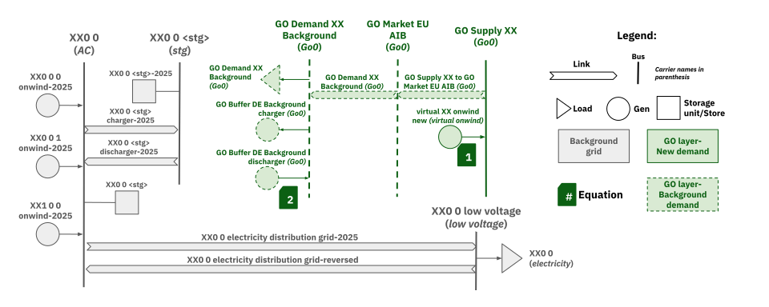
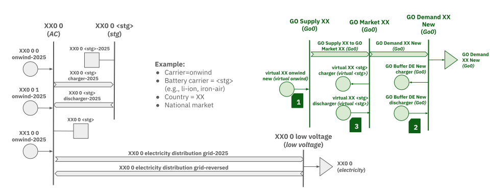

This script, `add_certificate.py`, is a specialized script developed for the Google-GO project within the PyPSA-Eur workflow. It is designed to integrate Guarantee of Origin (GO) certificates into energy system models. It essentially creates "virtual" representations of power plants and storage units, and sets up a market for these certificates within the PyPSA network.

---

## GO Market

The model incorporates two frameworks for simulating GO markets:

### Background GO Market

The Background Market is built upon the standards of the Association of Issuing Bodies (AIB), which currently facilitates the transfer of certificates across 25 of the 34 modeled countries. This framework utilizes annual volume matching based on historical AIB demand statistics rather than granular hourly tracking. 

**Figure 1** - Scheme of Background GO Market PyPSA components. For the equation details, refer to [Solve Network Constraints](solve_network_constraints.md)

To integrate certificate trading into the energy system model without interfering with physical grid constraints, the script employs a specialized schematic consisting of three "virtual" buses. This structure allows the model to track the "green" attributes of electricity separately from the physical electrons.

- The Supply Bus: This bus acts as a collection point, aggregating all power plants within a specific country that meet the eligibility criteria to participate in the GO market.
- The Market Bus: This serves as the clearinghouse for the system. In the AIB configuration, all potential certificate providers and consumers are pooled into a single market bus.
- The Demand Bus: This bus contains the certificate loads. These loads represent the specific demand for GOs driven by historical AIB cancellation data.

To read more about equations mentioned in the schematic, see [Solve Network Constraints](solve_network_constraints.md)
 
> **Note:** Although this specific feature is not currently utilized in the primary modeling scenarios, the architecture remains fully integrated and available for sensitivity analysis or historical comparisons.

### New GO Market

The New GO Market is designed for high levels of customization in both present and future energy scenarios. Participation in this market is restricted to production capacities commissioned within their first five years of operation, ensuring a focus on relatively new infrastructure. Certificate demand is allocated proportionally according to the electricity consumption of commercial and industrial sectors. Unlike the AIB-based system, this market can include all modeled countries and offers the flexibility to be configured as either a series of national markets or a single, EU-wide trading zone.

**Figure 2** - Scheme of New GO Market PyPSA components. For the equation details, refer to [Solve Network Constraints](solve_network_constraints.md)

These are the main difference compared to the Background GO Market

- All countries have the option to participate in the GO Market.
- In the New Market configuration, market buses can be nationalized or expanded to a European wide scale. Only national based GO markets have the option for batteries to participate in the GO market.
- Demand buses are not based on AIB, but rather on customizable load profiles that can be based on electricity load profiles and refactored by industrial and commercial consumers (CIs).

> **Note:** The background and new GO market are independent of each other. This means it is possible to turn both on at the same time.

---

## Functions

Here's a breakdown of its main functions, categorized by their roles:

*   **Functions for Filtering and Binding with GO Market**:
    *   **`get_virtual_ppl_dataframe`**: Constructs a DataFrame that defines virtual power plants (VPPs) by grouping real power plant units (generators and links) based on certificate criteria. This information is used both here and for constraints in `solve_network.py`.
    *   **`get_virtual_storage_dataframe`**: Identifies real storage units and their associated charger/discharger links, grouping them into virtual storage systems for certificate tracking. This information is used both here and for constraints in `solve_network.py`.
    *   **`get_go_background_demand`**: Generates a background Guarantee of Origin (GO) electricity demand profile for each country based on historical AIB statistics.

*   **Functions for Creating the GO Layer**:
    *   **`add_virtual_carriers`**: Adds "virtual" carriers to the PyPSA network, which are duplicates of existing carriers used for tracking certificate flows.
    *   **`add_virtual_ppl`**: Adds virtual power plants to the PyPSA network as aggregate virtual generators and creates corresponding virtual buses.
    *   **`add_demand`**: Adds GOs demand to the PyPSA network by creating new buses and loads representing the certificate demand.
    *   **`add_go_market`**: Establishes a market bus for Guarantees of Origin, connecting GO supply and demand buses.
    *   **`add_virtual_storage`**: Adds virtual storage units to the PyPSA network as virtual generators, connected to national "GO Market" buses.

*   **Supporting Functions**:
    *   **`get_geo_center`**: Computes the geographic center (centroid) of countries or regions from a shapefile, used for placing virtual buses on a map.
    *   **`extract_AIB_statistics`**: Downloads, processes, and exports electricity cancellation statistics from the AIB's dataset.
    *   **`retrieve_ci_load`**: Retrieves industrial and commercial electricity load data.
    *   **`get_load_demand`**: Extracts and processes electricity load demand from the PyPSA network.

The script's overall workflow involves:

1.  **Virtual Carrier Addition**: Adds "GOs" as a carrier and creates virtual carriers based on plant groupings.
2.  **Virtual Power Plant Creation**: Groups real generators and links into virtual power plants and adds them to the network.
3.  **Demand Integration**:
    *   If enabled, calculates and adds "background" GOs demand using AIB statistics and creates a corresponding market.
    *   If enabled, calculates and adds "new" GOs demand based on load profiles and creates a corresponding market.
4.  **Virtual Storage Integration**: If national scope demands are enabled and storage carriers are defined, groups real storage units into virtual storage and adds them to the network.

Essentially, this script extends a standard PyPSA energy model to include the complexities of a Guarantee of Origin certificate system, allowing for the simulation and analysis of certificate trading and its impact on the energy system.
