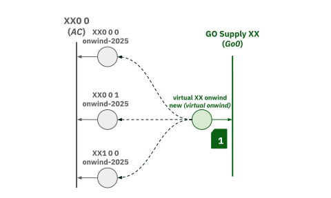
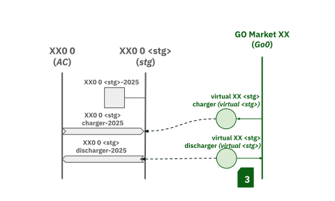

This section outlines specific functions within the `solve_network.py` script that are particularly relevant to the Google-GO project. These functions introduce custom constraints and functionalities to the PyPSA network, enabling specialized modeling for Guarantee of Origin (GO) certificates and renewable energy targets.

---

## Background Constraints

### Add RPS Constraints

**`add_rps_constraints(n, planning_horizons)`**: This function is utilized when national renewable energy targets are activated. It adds Renewable Portfolio Standard (RPS) constraints to the network, based on TYNDP (Ten-Year Network Development Plan) results or manual inputs. These constraints enforce a minimum share of renewable energy generation at a national or system-wide level for each planning horizon.

**Mathematical Formulation:**

For country-specific targets:

$$
\sum_{c \in \text{RES}} \sum_{t} P_{c,t}^{\text{dispatch}} \cdot w_t \geq \text{Share}_{\text{RES}} \cdot \sum_{c \in \text{All}} \sum_{t} P_{c,t}^{\text{dispatch}} \cdot w_t 
$$

For system-wide targets (EU+):

$$
\sum_{\text{country}} \sum_{c \in \text{RES}} \sum_{t} P_{c,t}^{\text{dispatch}} \cdot w_t \geq \text{Share}_{\text{RES,EU+}} \cdot \sum_{\text{country}} \sum_{c \in \text{All}} \sum_{t} P_{c,t}^{\text{dispatch}} \cdot w_t
$$

Where:

* \( P_{c,t}^{\text{dispatch}} \) is the dispatch of asset \(c\) at time \(t\).
* \( w_t \) is the snapshot weighting for time \(t\).
* \( \text{RES} \) refers to renewable energy carriers.
* \( \text{All} \) refers to all electricity-producing carriers.
* \( \text{Share}_{\text{RES}} \) is the renewable energy share target for a country.
* \( \text{Share}_{\text{RES,EU+}} \) is the system-wide renewable energy share target.

---

## GO Constraints

The following functions (`add_virtual_ppl_matching`, `add_buffer_matching`, and `add_virtual_storage_matching`) are activated only when the `certificate` option is set to `true` in the `enable` configuration.

### Add Virtual Powerplant Matching

**`add_virtual_ppl_matching(n)`**: This function is crucial for binding the generation of electricity in the background PyPSA model to the Guarantee of Origin (GO) layer. It ensures that the output of virtual power plants (VPPs) in the GO layer accurately reflects the aggregated power generation from their corresponding real power plant units (generators and links) in the background model.

**Visualization:**

> **Note**: onshore wind example.

**Mathematical Formulation:**

For power plants defined as generators:

$$
P^{\text{VPP}}_{v,t} \leq \sum_{g \in \text{VPP}_v} P^{\text{gen}}_{g,t}
$$

For power plants defined as links:

$$
P^{\text{VPP}}_{v,t} \leq \sum_{l \in \text{VPP}_v} P^{\text{link}}_{l,t} \cdot \eta_l
$$

Where:

* \( P^{\text{VPP}}_{v,t} \) is the power output of virtual power plant \(v\) at time \(t\).
* \( P^{\text{gen}}_{g,t} \) is the power output of real generator \(g\) at time \(t\).
* \( P^{\text{link}}_{l,t} \) is the power flow through real link \(l\) at time \(t\).
* \( \eta_l \) is the efficiency of link \(l\).
* \( \text{VPP}_v \) denotes the set of real generators and links aggregated into virtual power plant \(v\).

### Add Buffer Matching

**`add_buffer_matching(n)`**: This function establishes constraints related to the GOs buffer, which manages hourly matching limits. It ensures that the sum of buffer dischargers is equivalent to the sum of buffer chargers, and that the buffer discharge does not exceed the defined hourly matching limits, facilitating the accounting of GOs certificates over time.

**Mathematical Formulation:**

1.  **Buffer Balance Constraint:**

    $$
    \sum_{g \in \text{Chargers}} \sum_{t} P^{\text{gen}}_{g,t} = \sum_{g \in \text{Dischargers}} \sum_{t} P^{\text{gen}}_{g,t}
    $$

    Where:

    - \( P^{\text{gen}}_{g,t} \) is the dispatch of buffer generator \(g\) at time \(t\).
    - \( \text{Chargers} \) are buffer generators that consumes GOs (sign -1).
    - \( \text{Dischargers} \) are buffer generators that produces GOs (sign 1).

2.  **Hourly Matching Limit Constraint:**

    $$
    \sum_{t} P^{\text{gen}}_{g,t} \cdot w_t \leq P^{\text{nom}}_{g} \quad \forall g \in \text{Dischargers}
    $$

    Where:

    - \( P^{\text{gen}}_{g,t} \) is the dispatch of buffer generator \(g\) at time \(t\).
    - \( w_t \) is the snapshot weighting for time \(t\).
    - \( P^{\text{nom}}_{g} \) is the nominal capacity of buffer generator \(g\), defined in the **`add_demand`** function described in [Add Certificate](add_certificate.md) as:
    
    $$
    P^{\text{nom}}_{g} = (1 - \text{HM}) \cdot \sum_{t} P^{\text{set}}_{l,t} \cdot w_t \quad \forall l \in \text{GO loads}
    $$
    
    where \( P^{\text{set}}_{l, t} \) is the input certificate consumption of the GO load \(l\) at time \(t\) and \( \text{HM} \) is the hourly matching requirement.
    
    - \( \text{Dischargers} \) are buffer generators that produces GOs (sign 1).

> **Note:** These equations refer to _Equation 2_ block in the schematics in [Add Certificate](add_certificate.md).

### Add Virtual Storage Matching

**`add_virtual_storage_matching(n)`**: Similar to `add_virtual_ppl_matching`, this function binds the storage operations in the background PyPSA model to the GO layer. It ensures that the virtual storage units in the GO layer accurately reflect the charging and discharging activities of their corresponding real storage units in the background model.

**Visualization:**

**Mathematical Formulation:**

$$
P^{\text{VS}}_{s,t} = \sum_{l \in \text{VS}_s} P^{\text{link}}_{l,t} \cdot \eta_l
$$

Where:

- \( P^{\text{VS}}_{s,t} \) is the power output of virtual storage unit \(s\) at time \(t\).
- \( P^{\text{link}}_{l,t} \) is the power flow through real link \(l\) (charger/discharger) at time \(t\).
- \( \eta_l \) is the efficiency of link \(l\).
- \( \text{VS}_s \) denotes the set of real links (chargers/dischargers) aggregated into virtual storage unit \(s\).

---

## Additional Storage Constraints

### Add Storage Inverter Fix

**`add_storage_inverter_fix(n)`**: This function introduces a constraint to ensure that for certain storage technologies (excluding H2 and H2 tank), the charger capacity is equivalent to the discharger capacity, adjusted by efficiency.

**Mathematical Formulation:**

$$
P^{\text{nom}}_{\text{charger}, s} - P^{\text{nom}}_{\text{discharger}, s} \cdot \eta_s = 0 \quad \forall s \in \text{StorageTechs}
$$

Where:

- \( P^{\text{nom}}_{\text{charger}, s} \) is the nominal capacity of the charger for storage technology \(s\).
- \( P^{\text{nom}}_{\text{discharger}, s} \) is the nominal capacity of the discharger for storage technology \(s\).
- \( \eta_s \) is the efficiency of the discharger for storage technology \(s\).

### Add Storage Duration Fix

**`add_storage_duration_fix(n)`**: This function adds a constraint to ensure that the Power-to-Energy (P/E) ratio for batteries is based on their `max_hours` configuration.

**Mathematical Formulation:**

$$
E^{\text{nom}}_{s} = P^{\text{nom}}_{\text{charger}, s} \cdot \text{max_hours}_s \quad \forall s \in \text{StorageTechs}
$$

Where:

- \( E^{\text{nom}}_{s} \) is the nominal energy capacity of storage technology \(s\).
- \( P^{\text{nom}}_{\text{charger}, s} \) is the nominal capacity of the charger for storage technology \(s\).
- \( \text{max_hours}_s \) is the maximum hours of storage for technology \(s\).

These constraints provide the possibility of having batteries that do not participate in the market, making stores 
and storage units essentially equivalent for these battery types. Both `add_storage_inverter_fix(n)` and 
`add_storage_duration_fix(n)` impact storages that are defined as PyPSA stores and links to make them behave as 
storage_units. Storages defined as stores and links are bound with the GO Layer, whereas storage_units are not.