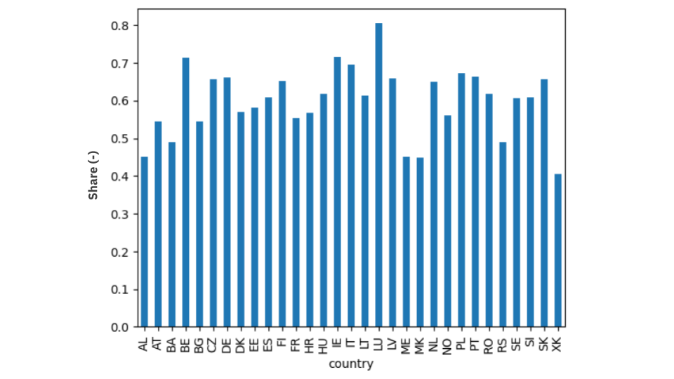

# Assumptions

This document outlines the key modeling assumptions that differentiate the Google-GO project from the standard PyPSA-Eur model. While the project builds upon the PyPSA-Eur framework, several assumptions have been introduced to better fit the project scope.

The modeling assumptions are organized into four main groups, each addressing a specific aspect of the energy system that requires customization beyond the default PyPSA-Eur configuration:

1. **Electricity Demand**: Assumptions related to the demand, profile, and evolution of the electricity across different sectors
2. **Clean Firm Technologies**: Assumptions related to the techno-economic characterization of dispatchable clean generation technologies
3. **CO2 Price**: Assumptions related to carbon pricing mechanisms
4. **Generation Expansion**: Assumptions related to the capacity expansion of clean and conventional generation technologies

## 1. Electricity Demand

To simplify the model and focus on the electricity sector, demands from low-voltage, industry, agriculture, heating, and hydrogen are aggregated into a single electricity load, while transport demand remains separate due to its dependency on EV batteries. 

To compensate for the absence of full sector coupling modeling, the electricity demand framework combines default [PyPSA-Eur](https://pypsa-eur.readthedocs.io/en/latest/introduction.html) assumptions with [TYNDP-2024](https://2024.entsos-tyndp-scenarios.eu/download/) projections. Specifically:

- **PyPSA-Eur**: provides demand for low-voltage, industry, agriculture, and transport
- **TYNDP-2024**: provides demand for [heating](https://2024-data.entsos-tyndp-scenarios.eu/files/scenarios-inputs/Demand_Scenarios_TYNDP_2024_After_Public_Consultation.xlsb.zip) and [hydrogen](https://2024.entsos-tyndp-scenarios.eu/download/)

Within the aggregated electricity demand, Commercial and Industry (C&I) demand - which participates in the GO market - is further characterized using data from [Eurostat](https://ec.europa.eu/eurostat/databrowser/view/nrg_cb_e__custom_16270810/default/table?lang=en) and [IEA](https://www.iea.org/data-and-statistics/data-product/world-energy-balances-highlights) to determine its share and load profile.

### 1.1 Heating and Hydrogen Electrification

Both demand components are computed following a consistent methodology:

- Derived from TYNDP 2024 results
- Calculated as a share of net final electricity demand excluding transport (since transport is modeled separately in PyPSA-Eur)
- Based on the National Trends scenario (aligned with most recent policies)
- Applied to the PyPSA load, neglecting profile differences

**Table 1** - Heating- and hydrogen-related electricity demand shares.

| Demand Component | 2025 | 2030 | 2035 | 2040 |
|:-----------------|:-----|:-----|:-----|:-----|
| Heating          | 16%  | 16%  | 16%  | 16%  |
| Hydrogen         | 4%   | 7%   | 14%  | 21%  |

**Heating Demand:**

- Includes space heating, cooling, and hot water needs in buildings and households
- The source provides only 2019-Historical and 2040 and 2050-Deviation Scenarios. So, 2019 data are kept constant across the planning horizon
- These shares do not account for hydrogen-related demand at the denominator

**Hydrogen Demand:**

- Includes electricity demand from all electrolyzers
- The source ([TYNDP 2024-Scenarios Report-Data and Figures](https://2024.entsos-tyndp-scenarios.eu/download/)) provides 2030- and 2040-National Trends. So, 2025 and 2035 were interpolated assuming null demand in 2020
- These shares account for heat-related demand at the denominator, so they should be used only when heating demand is also included. However, the code is flexible and allows separate handling of demands if needed

For implementation details, see `config.go.yaml` and `strip_network.py` (described in `go_project_config.md` and `strip_network_explanation.md`).

### 1.2 Commercial and Industry Demand

Demand from commercial and industry customers is derived from the C&I share over total electricity consumption as it follows:

- [Eurostat](https://ec.europa.eu/eurostat/databrowser/view/nrg_cb_e__custom_16270810/default/table?lang=en) is the main source
- United Kingdom (GB) and Switzerland (CH) are absent in Eurostat, so energy balance statistics from [IEA](https://www.iea.org/data-and-statistics/data-product/world-energy-balances-highlights) are used instead
- Only the latest full available data are used: Eurostat-2023, IEA-2022
- C&I shares are kept constant across the time horizon, without accounting for potential future changes (e.g., data center growth or deindustrialization). However, values can be manually modified by users

For implementation details, see `config.go.yaml` (described in `go_project_config.md`).

**Figure 1** - 2023 C&I share over the final electricity consumption (Source: [Eurostat](https://ec.europa.eu/eurostat/databrowser/view/nrg_cb_e__custom_16270810/default/table?lang=en)).

## 2. Clean Firm Technologies

Two types of clean firm technologies are considered:

- **Green Open Cycle Gas Turbine (Green OCGT)**: low-CAPEX, high-OPEX technology using green hydrogen as fuel
- **Advanced Clean Firm**: capital-intensive technology serving as a proxy for advanced nuclear or advanced geothermal

**Data Sources:**

The techno-economic parameters are derived from multiple sources:

- **Investment cost, fixed operation and maintenance (O&M), variable O&M, and lifetime**: [Lazard LCOE - June 2025](https://www.lazard.com/media/uounhon4/lazards-lcoeplus-june-2025.pdf). Where ranges were provided, the mean values were used
- **Fuel cost and efficiency**: [PyPSA Technology Data](https://github.com/PyPSA/technology-data/blob/master/outputs)
- **Green hydrogen price**: [EU Clean Hydrogen Observatory](https://observatory.clean-hydrogen.europa.eu/index.php/hydrogen-landscape/production-trade-and-cost/cost-hydrogen-production)

**Currency Conversion:**

Lazard costs are reported in $2025, while PyPSA-Eur uses €2020 as reference currency. The conversion was performed in two steps:

1. Dollar-to-Euro conversion using the 2025 exchange rate
2. Inflation adjustment to €2020 using [Average annual Harmonised Index of Consumer Prices (HICP) - EU27](https://ec.europa.eu/eurostat/databrowser/view/prc_hicp_aind/default/table?lang=en)

**Cost Processing:**

The input data were processed to derive the two input cost parameters used in PyPSA-Eur, i.e., annualized capital and marginal costs. For Green OCGT, fuel costs available for 2030 and 2040 were interpolated to obtain values for 2025 and 2035, covering all planning horizons. For Advanced Clean Firm, all values were kept constant across the planning horizon.

The final cost parameters are computed as follows, where the annuity factor is calculated following the standard PyPSA-Eur approach (see `process_cost_data.py`), using the lifetime and a discount rate of 7% ($r$ is the discount rate and $n$ is the lifetime in years):

$$
\text{Annualized Capital Cost (€2020/MW-a)} = \text{annuity} \times \text{investment cost} + \text{fixed O\&M}
$$

$$
\text{annuity} = \frac{r}{1 - \frac{1}{(1 + r)^n}}
$$

$$
\text{Marginal Cost (€2020/MWh)} = \text{variable O\&M} + \frac{\text{fuel cost}}{\text{efficiency}}
$$

**Table 2** - Techno-economic characterization of clean firm technologies.

|                      | Investment Cost ($2025/kW) | FOM ($2025/kW-a) | VOM ($2025/MWh) | Fuel (€2020/MWh) (€2020/kg) | Efficiency | Lifetime | Annualized Capital Cost (€2020/MW-a) | Marginal Cost (€2020/MWh) |
|:---------------------|:---------------------------|:-----------------|:----------------|:----------------------------|:-----------|:---------|:-------------------------------------|:--------------------------|
| **Green OCGT**       | 1,150 – 1,450              | 10.00 – 17.00    | 3.50 – 5.00     | '30: 150.0 (5.0) '40: 90.0 (3.0) | 0.40       | 30       | 72,790                               | '25: 444.7 '30: 371.1 '35: 297.5 '40: 223.8 |
| **Advanced Clean Firm** | 9,020 – 14,820          | 136.00 – 158.00  | 4.40 – 5.15     | 3.41                        | 0.33      | 70       | 585,153                              | 13.6                      |

For implementation details, see `config.go.yaml` (described in `go_project_config.md`). For details on the techno-economic characterization of the other power plants and storage technologies, see [PyPSA Technology Data](https://github.com/PyPSA/technology-data/blob/master/outputs).

## 3. CO2 Price

Four CO2 price levels are identified to study their interaction with GO markets as sensitivities:

- **Base: 0 €/t** - No carbon pricing mechanism
- **Low: 25 €/t** - Proxy for US carbon markets (Sources: [California cap-and-trade program](https://ww2.arb.ca.gov/sites/default/files/2020-08/results_summary.pdf) and [The Regional GHG Initiative-Eastern States](https://www.rggi.org/auctions/auction-results/prices-volumes))
- **Medium: 50 €/t** - Proxy for EU market based on average annual value for 2024 EU ETS ~64.74 €2024/t (~53 €2020/t) (Source: [International Carbon Action Partnership](https://icapcarbonaction.com/en/ets/eu-emissions-trading-system-eu-ets)) and stated policies values ([IEA World Energy Outlook 2024](https://iea.blob.core.windows.net/assets/140a0470-5b90-4922-a0e9-838b3ac6918c/WorldEnergyOutlook2024.pdf))
- **High: 100 €/t** - Proxy for net zero emission scenarios ([IEA World Energy Outlook 2024](https://iea.blob.core.windows.net/assets/140a0470-5b90-4922-a0e9-838b3ac6918c/WorldEnergyOutlook2024.pdf))

For implementation details, see `config.go.yaml` (described in `go_project_config.md`).

## 4. Generation Expansion

The assumptions on extendable generators follow the default PyPSA-Eur configuration (for details, see `config.default.yaml` and [PyPSA-Eur documentation](https://pypsa-eur.readthedocs.io/en/latest/configuration.html#electricity)). Extendable technologies include:

- All solar and wind types
- Open Cycle Gas Turbine (OCGT) and Combined Cycle Gas Turbine (CCGT)
- Clean firm technologies described in Section 2

Additionally, renewable generation targets are derived from [TYNDP-2024-National Trends scenario results](https://2024.entsos-tyndp-scenarios.eu/visualisation-platform/). These targets are designed for use in the Renewable Portfolio Standard (RPS) sensitivity (see `go_project_scenarios.md`) as minimum generation constraints relative to total electricity generation. For implementation details, see `config.go.yaml` (described in `go_project_config.md`) and `solve_network_constraints.md`.

Such shares are defined for each planning horizon and country, including system-level (denoted as EU+). Values are taken from TYNDP-2024 National Trends scenario, which provides data for 2030 and 2040 only. Therefore, 2035 values were interpolated. Kosovo is the only country absent from TYNDP data, for which a 43% target is imposed for all years based on 2030 value from an [Ember study](https://ember-energy.org/data/global-renewable-power-sector-targets-2030/). (TYNDP and Ember are well aligned, e.g., system-level targets at 2030 from both sources are essentially the same ~73%).

**Table 3** - RPS at country and system (i.e., EU+) level.

| Country              | 2030 | 2035 | 2040 |
| :------------------- | :--: | :--: | :--: |
| System (EU+)         | 0.74 | 0.78 | 0.83 |
| Albania (AL)         | 0.93 | 0.96 | 0.99 |
| Austria (AT)         | 0.92 | 0.92 | 0.92 |
| Bosnia (BA)          | 1.00 | 0.92 | 0.85 |
| Belgium (BE)         | 0.58 | 0.66 | 0.74 |
| Bulgaria (BG)        | 0.34 | 0.33 | 0.32 |
| Switzerland (CH)     | 0.82 | 0.90 | 0.98 |
| Czechia (CZ)         | 0.33 | 0.34 | 0.35 |
| Germany (DE)         | 0.91 | 0.92 | 0.94 |
| Denmark (DK)         | 0.84 | 0.89 | 0.94 |
| Estonia (EE)         | 0.69 | 0.80 | 0.92 |
| Spain (ES)           | 0.82 | 0.88 | 0.94 |
| Finland (FI)         | 0.77 | 0.83 | 0.89 |
| France (FR)          | 0.36 | 0.44 | 0.52 |
| Great Britain (GB)   | 0.83 | 0.82 | 0.82 |
| Greece (GR)          | 0.71 | 0.81 | 0.91 |
| Croatia (HR)         | 0.92 | 0.90 | 0.88 |
| Hungary (HU)         | 0.29 | 0.32 | 0.35 |
| Ireland (IE)         | 0.89 | 0.91 | 0.93 |
| Italy (IT)           | 0.72 | 0.78 | 0.85 |
| Lithuania (LT)       | 0.94 | 0.96 | 0.97 |
| Luxembourg (LU)      | 0.95 | 0.96 | 0.96 |
| Latvia (LV)          | 0.89 | 0.89 | 0.89 |
| Montenegro (ME)      | 1.00 | 1.00 | 1.00 |
| North Macedonia (MK) | 0.47 | 0.57 | 0.68 |
| Netherlands (NL)     | 0.81 | 0.86 | 0.92 |
| Norway (NO)          | 0.99 | 0.99 | 0.99 |
| Poland (PL)          | 0.64 | 0.60 | 0.56 |
| Portugal (PT)        | 0.96 | 0.98 | 0.99 |
| Romania (RO)         | 0.54 | 0.58 | 0.62 |
| Serbia (RS)          | 0.65 | 0.67 | 0.69 |
| Sweden (SE)          | 0.77 | 0.83 | 0.89 |
| Slovenia (SI)        | 0.49 | 0.53 | 0.58 |
| Slovakia (SK)        | 0.28 | 0.32 | 0.35 |
| Kosovo (XK)          | 0.43 | 0.43 | 0.43 |
