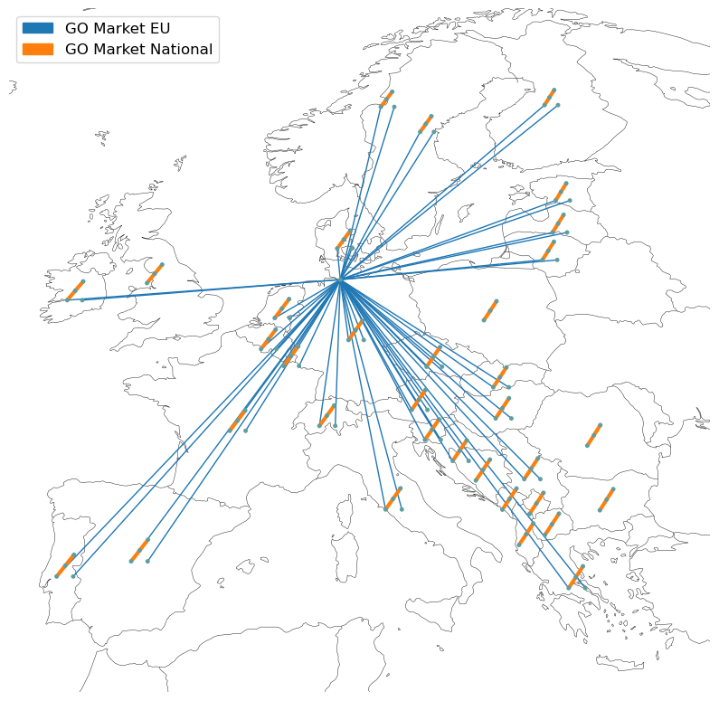

# Background

Guarantees of Origin (GOs) are certificates used in Europe proving that energy has been generated from renewable sources. This thus allows final customers, such as commercial and industry (C&I) ones, to buy and claim renewable energy, separating the "green" attribute from the physical electrons. Annual GOs matches renewable supply and consumption at annual level. They are the standard GOs and are issued at national level. Then, the [Association of Issuing Bodies (AIB)](https://www.aib-net.org/) coordinates the national issuing bodies, ensuring consistency across countries and facilitating cross-border trading. Instead, hourly GOs, also referred to as hourly Granular Certificates (GCs), are newer and more granular type, enabling near real-time matching between renewable supply and consumption.

This project aims to assess how annual and hourly GOs procurement can operate as an investment signal for the energy transition. This is done by comparing the system-level impacts in terms of: capacity expansion, asset-level dispatch, total system costs and emissions, GO pricing and market value. Also, the impacts are evaluated at country-level and by running several sensitivies. The latter aim to explore different: C&I demand participation, hourly matching requirements, and interaction with other market-based policies (e.g., CO2 price or renewable portfolio standards).

## Model Scope
To balance spatial and temporal resolution with computational efficiency, the model scope is defined as follows:

* **Spatial Scope**:
    * Geography: 34 countries.
    * Resolution: 39 nodes (ensuring that each country is represented by at least one node).
* **Temporal Scope**:
    * Planning horizons: from 2025 to 2040, with 5-years interval.
    * Resolution: 3-hours interval.
* **Sectoral Scope**:
The model is limited to the electricity sector, as it is the primary focus for clean procurement strategies. However, electrification of heating and hydrogen demand can be exogenously accounted for by means of dedicated configuration settings.
* **Technology Scope**:
The technologies eligible for the procurement involve all renewable energy sources, as well as short and long-duration energy storage options and clean firm technologies.