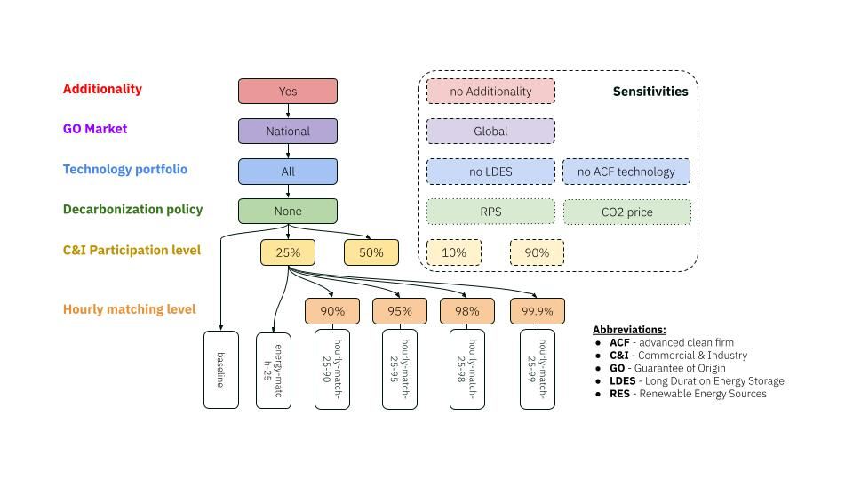

# Google-GO Project Scenarios: `scenarios.go.yaml`

This document provides a comprehensive overview of the scenario definitions used in the Google-GO project, specifically focusing on the `config/scenarios.go.yaml` file. This configuration file enables the systematic exploration of different Guarantee of Origin (GO) market designs and policy interactions through a structured set of scenarios.

## 1. Overview and Purpose

The `scenarios.go.yaml` file defines a collection of scenarios that share the base configuration from `config.default.yaml` and `config.go.yaml`, but override specific parameters to explore different modeling assumptions. The hierarchical configuration structure works as follows:

1. **Base Configuration**: `config.default.yaml` provides the default PyPSA-Eur settings
2. **Project Configuration**: `config.go.yaml` overrides defaults with Google-GO specific settings (as described in `go_project_config.md`)
3. **Scenario Configuration**: `scenarios.go.yaml` further overrides specific parameters for each scenario

This file is integrated into the Snakemake workflow through the `run.scenarios` section in `config.go.yaml`, where:
- `run.scenarios.enable` is set to `true` to activate scenario-based modeling
- `run.scenarios.file` points to `config/scenarios.go.yaml`

An overview of the scenarios analyzed is provided in the scenario tree in Figure 1. The scenarios are organized into two main groups:
- **Main Scenarios** (11 scenarios): Core scenarios exploring different levels of Commercial & Industry (C&I) participation and hourly matching requirements
- **Sensitivities** (12 scenarios): Additional scenarios examining policy interactions, market scope, technology constraints, and additionality requirements

Each scenario name becomes part of the output file paths, enabling systematic organization of results across multiple scenario runs.

**Figure 1** - Scenario tree of the Google GO Project.

## 2. Main Scenarios

The main scenarios form the core analysis of how different GO market designs impact the electricity system.

All main scenarios (except baseline) enable the `certificate.new_demand` feature and focus on C&I participants (`participant: ci`). The scenarios systematically vary two key parameters:
- **Energy matching**: The percentage of C&I electricity demand participating in GO procurement (25% or 50%)
- **Hourly matching**: The percentage of hourly demand that must be matched with hourly renewable generation (0%, 90%, 95%, 98%, or 99.9%). Hourly matching of 0% refers to annual GO matching.

### 2.1 Baseline and Energy Matching Scenarios

These scenarios explore the base case without GO procurement and annual energy matching without hourly requirements.

| Scenario Name | `enable.certificate` | `certificate.new_demand.enable` | `certificate.new_demand.participant` | `certificate.new_demand.energy_matching` (%) | `certificate.new_demand.hourly_matching` (%) | Description |
| :------------ | :------------------- | :------------------------------ | :----------------------------------- | :------------------------------------------- | :------------------------------------------- | :---------- |
| baseline | false | - | - | - | - | Reference scenario without GO market modeling, used as comparison baseline for all other scenarios. |
| energy-match-50 | true (default) | true | ci | 50 | 0 | 50% of C&I demand participates in GO procurement with annual energy matching only (no hourly requirements). |
| energy-match-25 | true (default) | true | ci | 25 | 0 | 25% of C&I demand participates in GO procurement with annual energy matching only (no hourly requirements). |

### 2.2 Hourly Matching Scenarios - 50% C&I Participation

These scenarios examine the impact of increasingly stringent hourly matching requirements when 50% of C&I demand participates in GO procurement.

| Scenario Name | `certificate.new_demand.enable` | `certificate.new_demand.participant` | `certificate.new_demand.energy_matching` (%) | `certificate.new_demand.hourly_matching` (%) | Description |
| :------------ | :------------------------------ | :----------------------------------- | :------------------------------------------- | :------------------------------------------- | :---------- |
| hourly-match-50-90 | true | ci | 50 | 90 | 50% C&I participation with 90% hourly matching requirement. |
| hourly-match-50-95 | true | ci | 50 | 95 | 50% C&I participation with 95% hourly matching requirement. |
| hourly-match-50-98 | true | ci | 50 | 98 | 50% C&I participation with 98% hourly matching requirement. |
| hourly-match-50-99 | true | ci | 50 | 99.9 | 50% C&I participation with near-perfect (99.9%) hourly matching requirement. |

### 2.3 Hourly Matching Scenarios - 25% C&I Participation

These scenarios mirror the 50% participation series but with lower C&I involvement, exploring how participation levels moderate the impact of hourly matching requirements.

| Scenario Name | `certificate.new_demand.enable` | `certificate.new_demand.participant` | `certificate.new_demand.energy_matching` (%) | `certificate.new_demand.hourly_matching` (%) | Description |
| :------------ | :------------------------------ | :----------------------------------- | :------------------------------------------- | :------------------------------------------- | :---------- |
| hourly-match-25-90 | true | ci | 25 | 90 | 25% C&I participation with 90% hourly matching requirement. |
| hourly-match-25-95 | true | ci | 25 | 95 | 25% C&I participation with 95% hourly matching requirement. |
| hourly-match-25-98 | true | ci | 25 | 98 | 25% C&I participation with 98% hourly matching requirement. |
| hourly-match-25-99 | true | ci | 25 | 99.9 | 25% C&I participation with near-perfect (99.9%) hourly matching requirement. |

## 3. Sensitivities

The sensitivity scenarios explore how GO market outcomes interact with other policy instruments and market design choices. These scenarios are organized into four thematic groups, each investigating a specific dimension of the GO market design space.

### 3.1 Policy Sensitivities

This group examines how GO markets interact with alternative energy policies, specifically Renewable Portfolio Standards (RPS) and carbon pricing mechanisms. The scenarios compare baseline cases (without GO markets) under different policy frameworks and assess how carbon pricing affects GO market outcomes.

The policy sensitivities include three baseline scenarios with different carbon prices (representing different regulatory contexts) and two GO market scenarios that combine hourly matching requirements with carbon pricing.

#### Baseline Policy Scenarios

These scenarios disable GO market modeling to isolate the effects of RPS and carbon pricing policies.

| Scenario Name | `enable.certificate` | `res_target.system_share_target` | `res_target.country_share_target` | `costs.emission_prices.co2` (€/t_CO2) | Description |
| :------------ | :------------------- | :------------------------------- | :-------------------------------- | :------------------------------------ | :---------- |
| baseline-rps | false | true | true | 0 (default) | Baseline with Renewable Portfolio Standard (RPS) policy instead of GO markets, enforcing renewable targets at system and country levels. |
| baseline-co2-price25 | false | false (default) | false (default) | 25 | Baseline with low carbon price (25 €/t_CO2), representing US-style carbon pricing without GO markets. |
| baseline-co2-price50 | false | false (default) | false (default) | 50 | Baseline with medium carbon price (50 €/t_CO2), representing EU-style carbon pricing without GO markets. |
| baseline-co2-price100 | false | false (default) | false (default) | 100 | Baseline with high carbon price (100 €/t_CO2) to assess stringent carbon policy without GO markets. |

#### GO Market with Carbon Pricing Scenarios

These scenarios combine GO market modeling (50% C&I participation, 99.9% hourly matching) with carbon pricing to assess policy interactions.

| Scenario Name | `enable.certificate` | `costs.emission_prices.co2` (€/t_CO2) | `certificate.new_demand.enable` | `certificate.new_demand.participant` | `certificate.new_demand.energy_matching` (%) | `certificate.new_demand.hourly_matching` (%) | Description |
| :------------ | :------------------- | :------------------------------------- | :------------------------------ | :----------------------------------- | :------------------------------------------- | :------------------------------------------- | :---------- |
| hourly-match-co2-price25-50-99 | true (default) | 25 | true | ci | 50 | 99.9 | GO market with 50% C&I participation and 99.9% hourly matching under low carbon price (US-style). |
| hourly-match-co2-price50-50-99 | true (default) | 50 | true | ci | 50 | 99.9 | GO market with 50% C&I participation and 99.9% hourly matching under medium carbon price (EU-style). |

### 3.2 GO Market Scope Sensitivities

This group explores the geographic scope of GO trading. The default configuration in `config.go.yaml` sets `certificate.new_demand.scope: national`, restricting GO trading to within each country. This sensitivity tests a `global` (European-wide) market scope.

| Scenario Name | `certificate.new_demand.enable` | `certificate.new_demand.scope` | `certificate.new_demand.participant` | `certificate.new_demand.energy_matching` (%) | `certificate.new_demand.hourly_matching` (%) | Description |
| :------------ | :------------------------------ | :----------------------------- | :----------------------------------- | :------------------------------------------- | :------------------------------------------- | :---------- |
| hourly-match-EU-50-99 | true | global | ci | 50 | 99.9 | EU-wide GO market allowing cross-border GO trading, with 50% C&I participation and 99.9% hourly matching. Compares to national scope in main scenarios. |

### 3.3 Technology Portfolio Sensitivities

This group investigates how technology availability affects GO market outcomes by restricting eligible technologies. The default configuration (from `config.go.yaml`) includes all renewable generators, nuclear, and advanced clean firm technologies for GO supply, plus both short-duration (li-ion) and long-duration (iron-air and hydrogen) energy storage (LDES).

These scenarios systematically remove technology categories to understand their role in enabling hourly matching.

#### LDES Restrictions

| Scenario Name | `certificate.storage_carriers` | `certificate.new_demand.enable` | `certificate.new_demand.participant` | `certificate.new_demand.energy_matching` (%) | `certificate.new_demand.hourly_matching` (%) | Description |
| :------------ | :----------------------------- | :------------------------------ | :----------------------------------- | :------------------------------------------- | :------------------------------------------- | :---------- |
| hourly-match-no-LDES-50-99 | [li-ion] | true | ci | 50 | 99.9 | Excludes long-duration energy storage (iron-air) from GO-eligible storage, allowing only short-duration lithium-ion batteries. Tests dependence on LDES for hourly matching. |

#### Clean Firm Restrictions

| Scenario Name | `certificate.plant_carriers` | `certificate.new_demand.enable` | `certificate.new_demand.participant` | `certificate.new_demand.energy_matching` (%) | `certificate.new_demand.hourly_matching` (%) | Description |
| :------------ | :--------------------------- | :------------------------------ | :----------------------------------- | :------------------------------------------- | :------------------------------------------- | :---------- |
| hourly-match-no-clean-firm-50-99 | [offwind, offwind-ac, offwind-dc, offwind-float, onwind, ror, hydro, urban central solid biomass CHP, geothermal, solar, solar-hsat, solar rooftop, nuclear, green_ocgt] | true | ci | 50 | 99.9 | Excludes advanced firm technologies (`adv_firm_tech`) from GO-eligible generators, removing dispatchable clean power. Tests reliance on firm generation for hourly matching. |

### 3.4 Additionality Sensitivities

This group examines the impact of additionality requirements—whether only new eligible capacity can supply GOs, or if existing capacity is also eligible. The default configuration in `config.go.yaml` sets `certificate.plant_status: [new]`, requiring additionality.

These scenarios remove the additionality requirement (`plant_status: [new, existing]`) and test it across different participation levels to understand how existing capacity availability affects GO market dynamics and investment signals.

| Scenario Name | `certificate.plant_status` | `certificate.new_demand.enable` | `certificate.new_demand.participant` | `certificate.new_demand.energy_matching` (%) | `certificate.new_demand.hourly_matching` (%) | Description |
| :------------ | :------------------------- | :------------------------------ | :----------------------------------- | :------------------------------------------- | :------------------------------------------- | :---------- |
| hourly-match-noadd-50-99 | [new, existing] | true | ci | 50 | 99.9 | No additionality requirement (existing plants eligible) with 50% C&I participation and 99.9% hourly matching. |
| hourly-match-noadd-10-99 | [new, existing] | true | ci | 10 | 99.9 | No additionality requirement with low (10%) C&I participation and 99.9% hourly matching, testing if low participation reduces need for new capacity. |
| hourly-match-noadd-90-99 | [new, existing] | true | ci | 90 | 99.9 | No additionality requirement with high (90%) C&I participation and 99.9% hourly matching, testing if existing capacity suffices even at high participation. |
